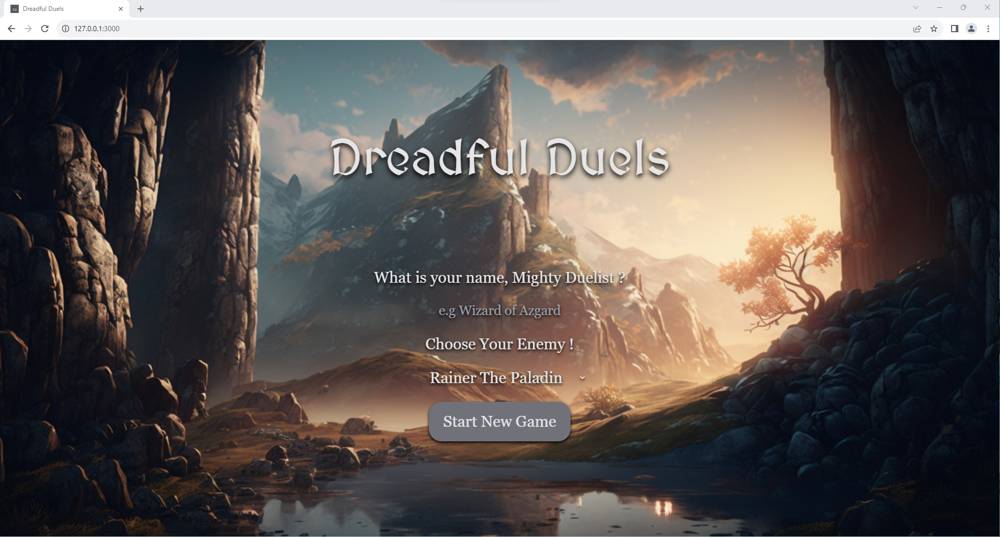
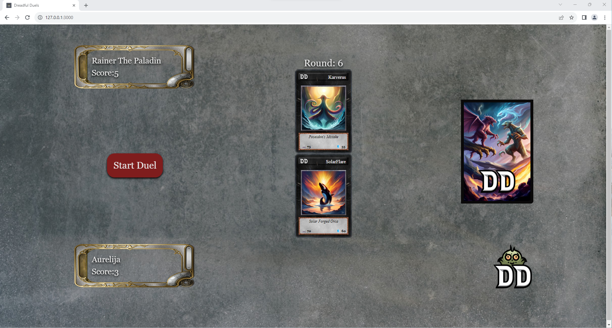

# Dreadful Duels
A prototype for a 2-player card duelling game, created with Java and JavaScript.

## Table of contents
* [Brief](#brief)
* [Images](#images)
* [Technologies](#technologies)
* [Setup](#setup)
* [How to play](#how-to-play)

## Brief
Create a demo for a simple turn-based card game.
* Create a custom API containing card data, (e.g. name, attack, defense).
* Create a game app. It should tally player scores as the game progresses, and declare victory, defeat, or a draw after 10 rounds.

## Images




## Technologies
Project is created with:
* Java
* Spring Boot
* JavaScript
* React

## Setup
1. Ensure you have the following installed:
* Maven (3.9.2)
* OpenJDK (20.0.2)
* Node.js (20.1.0)

2. Navigate to the `CardsAPI` directory, e.g. in IntelliJ IDEA:
```
$ cd ../dreadful_duels/cardsAPI
```

3. Run the file `CardsApiApplication` located in the below directory:
```
./src/main/java/com/dreadfulduels/cardsAPI/CardsApiApplication.java
```

4. The back-end is now running, and the API can be viewed at localhost:8080/cards

5. In a separate IDE window (e.g. in VSCode), navigate to the game app directory:
```
$ cd ../dreadful_duels/dreadful_duels_app
```

6. Install the dependencies and run the React app:
```
$ npm install
$ npm start
```

7. The game is now running on localhost:3000

## How to play
1. In the game menu, enter your name and choose an enemy name from the list, then click 'Start New Game'.
2. In the game arena, click once on the card deck. This will draw two cards - the top card is the enemy's, and the bottom card is yours. (**Important**: clicking on the deck more than once will break the game - if this happens, reload the page to start again)
3. Click 'Start Duel'. This will make the cards 'fight' by applying each one's attack value to the other's defence value. The card with the higher remaining defence value will win the round, and its player will receive a point.
4. Repeat steps 2 and 3 for nine more rounds. The end screen will declare your victory, defeat, or a draw.
5. Reload the page to start again.